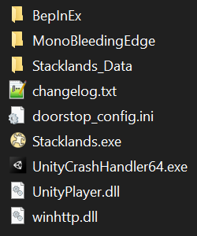

# Stacklands LargerBoard Mod

Increase the upper limit of the board size.

The board size in the game increases with the card limit (i.e. by building Sheds and Warehouses) but
there is an upper limit which is reached after just 21 Sheds or 6 Warehouses (or a combination thereof).
This mod allows increasing the limit by an arbitrary amount.

By default, the max board size is doubled (the original value is 2.5, the new values is 5).

To change it, you can adjust the configuration which will be generated at `BepInEx/config/de.benediktwerner.stacklands.LargerBoard.cfg`
after the first start.

## Installation
This mod requires BepInEx to work. BepInEx is a modding framework which allows multiple mods to be loaded.

1. Download BepInEx from https://github.com/BepInEx/BepInEx/releases. On Windows, use the x64 version, on Linux and MacOS, use the unix version.
2. Extract all files to your Stacklands folder. It should look like this:\

3. **Linux and MacOS only**: Additionally follow step three from [Installing BepInEx](https://docs.bepinex.dev/articles/user_guide/installation/index.html?tabs=tabid-nix)
4. Download this mod and extract it into `BepInEx/plugins/`
5. Launch the game

## Uninstall

To uninstall the mod, simply remove `BepInEx/plugins/de.benediktwerner.stacklands.LargerBoard.dll` in the game's installation directory.

If you aren't using any other BepInEx mods, you can also completley remove BepInEx by deleting the `BepInEx` directory and the `changelog.txt`, `doorstop_config.ini`
and `winhttp.dll` files.
